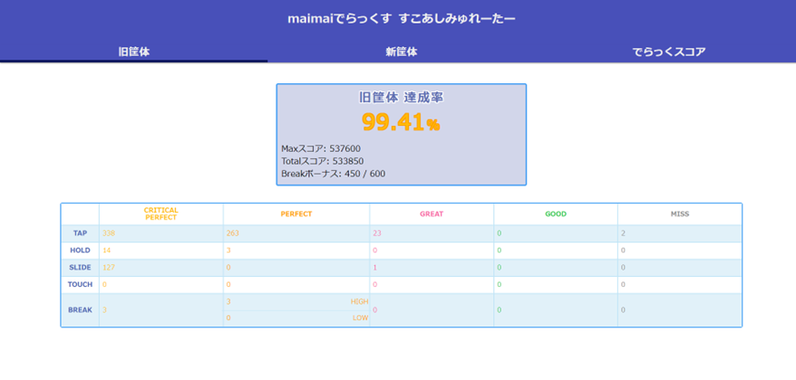

SEGAが制作している「maimaiでらっくす」のスコア計算ツール。でらっくスコア割合計算や新・旧筐体のスコア変換が可能。

<!-- truncate -->

## GitHub

https://github.com/marucircle/maimai-DX-Score-Simulation

## Deploy URL

https://maimai-dx-score-simulation.vercel.app/

## Example

