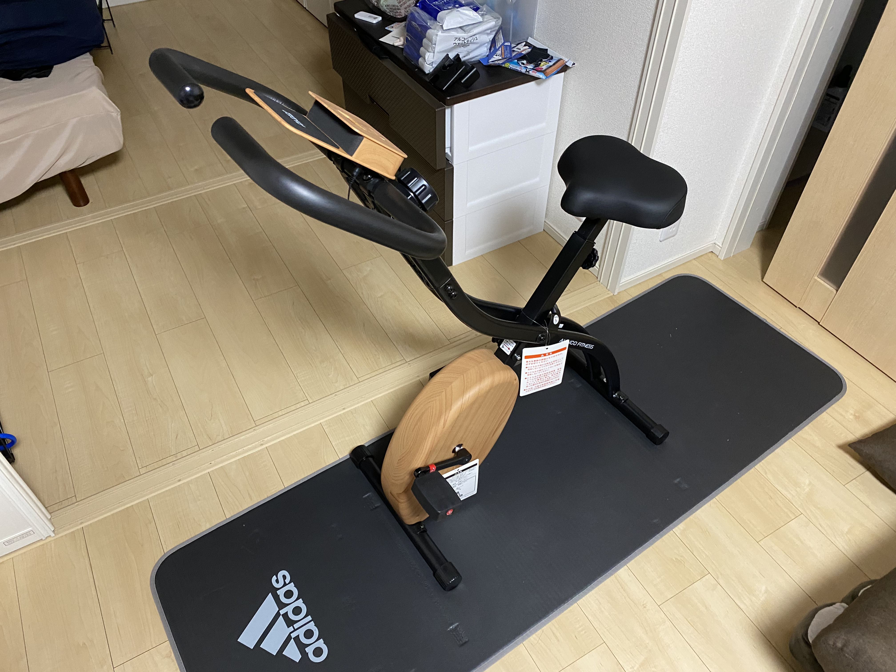

import TOCInline from '@theme/TOCInline'

二年前に作成していたサイトを新しく作り直したよーーーと言うご報告。

<!-- truncate -->

<TOCInline toc={toc} minHeadingLevel={2} maxHeadingLevel={4} />

## サイト、作り替えました。

どうもですーーーー見てる人いるのかね。

marucircle.com、通称「まる家」ですが、ちょいと運用が面倒だなーと言う気持ちになっていたのでこれを機にリニューアルしてみました。 
「運用が面倒」と言うのが、もともと技術スタックとしてはprismicと呼ばれるCMSを使っていて、記事であったりと言うのはそちらで管理していたのですね。

ただこれが思っていたより使いづらい。更新するモチベーションを維持できない要因になっちまいました。 
あと、思っていたよりCMSに分離して嬉しいことがそんなになかった。思いつきでやるもんじゃないですね。

というわけで。技術スタックを「Astro + prismic」から「docusaurus」に変えて作り直しです。 
作り直しといってもdocusaurusが相当優秀なんで時間も全然かからなかった感じ。（そもそもコンテンツがなかったのでそりゃそうと言う感じだけど。）

までももともと「まる家」作った時のモチベが「Astro使ってみたい！！」というのと「CMS使ってみたい！！」という探り探りの状態だったので、これはこれで良い経験になった気も。今回はどちらかというととにかく楽をしていきたいイメージで。

今までとは打って変わりmarkdownファイルをプロジェクト内で管理する形になりますが、これはこれで良いですね。あとmarkdownの記載によって表現できる見た目が豊富でありがたい。

「docusaurus」という名称通り本来はドキュメントサイト向けのものではあるのですが、ブログも似たようなもんですね。

## 何か変わった？

コンテンツとしてはそんなに変わりなく。ただ運用だけもっとカジュアルにしてしまおうと思ってます。 

「Blog」には気まぐれで日記のような感じで雑多書きを載せます。「Output」は僕のメモ書き。 
もし公開できるような成果物が生まれたらそれは「Artifact」に載せていきます。

## 地味だけどダークモードに対応しますた

ここだけの話、リニューアル前の「まる家」はダークモード対応してませんでした。つい最近気づきました。ちゃんとテストしとけー。。。 

docusaurusにリニューアルしたおかげでダークモードも勝手に対応してくれます！ありがたーー。 
（これからこの辺も配慮するようにしよう。。。）

## せっかくなので近況を綴っておく

ページは残していませんが、リニューアル前の「まる家」最終更新時はメンタルぶち壊しで体調終わってる時期でした。 

今年乗り切れるか不安だなーとなっていたのですが、今はだいぶ落ち着きまして。最近は運動量も増やして身体面、精神面での健康を維持できるよう気を使い始めてたり。 
折り畳みができるフィットネスバイクを導入したりしました。やったね。

正直半信半疑だったけど、これがなかなか運動が捗る。結果的に買って良かった。

:::warning[まあでも...]

20,000円吹っ飛ばしちゃったけどね。あとめーーっちゃ軽くAmazonでポチっちゃったけどちゃんと実物見て判断すべきですねこういうのは。。

:::

## 音ゲーはどんな？

体調を大幅に崩してから通常の生活は元に戻りつつあるのですが、音ゲーの方は中々リハビリできず...。正直、今まで程頑張ることはもう出来ないかも。頻度も多くて2週間に1回程度になっちゃった。

とはいえ友人との大切な繋がりの一つではあるので、今後もぼちぼち付き合っていくことにはなりそう。

こっそり手元出したりはしつつ。最近だとUltimate taste理論値を頑張ってた。

<iframe
  width="100%"
  height="300"
  src="https://www.youtube.com/embed/AjrWvOSG7M8?si=gvkHBU61FEk1dMa_"
  title="YouTube video player"
  frameBorder="0"
  allow="accelerometer; autoplay; clipboard-write; encrypted-media; gyroscope; picture-in-picture; web-share"
  referrerPolicy="strict-origin-when-cross-origin"
  allowFullScreen
></iframe>

:::info[突然ですが、ぱらどっとはいいぞ！！！！]

Ultimate taste、名曲です！！！というかぱらどっとさんの曲全部いいのでみんな聴こう！！！！
https://www.youtube.com/@paradot
:::

言ってしまえば「結局中途半端で終わってしまった」という形になりますが、まぁ割と重たい荷物ではあったのでようやく荷物を減らせる、と考えればそれはそれで良いのかも。

ちょっとチュウニズムのモチベが沸きそうな予感もしている。カラミティAJ出して辞めたいなーーー

## おわり

そんなわけで、改めてのんびり「まる家」動かします。よろしくたのんます。
